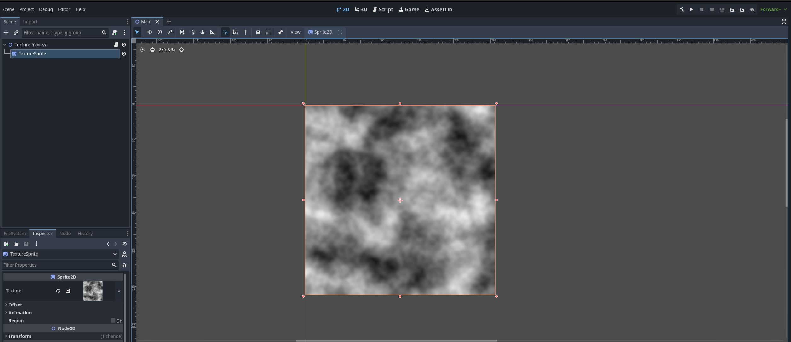
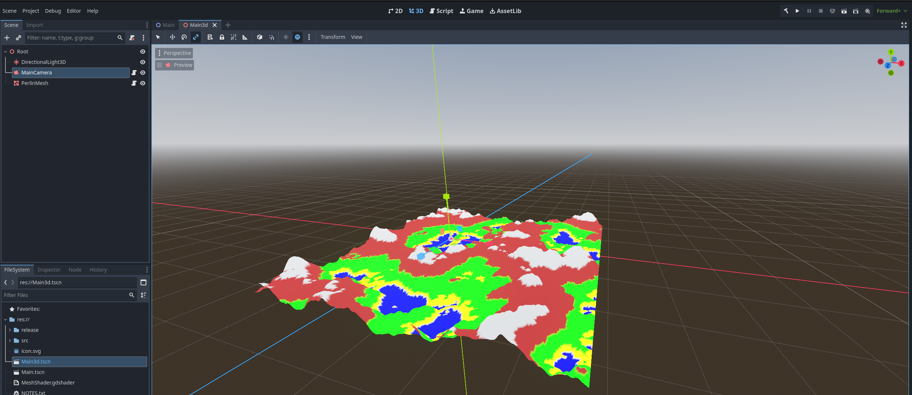
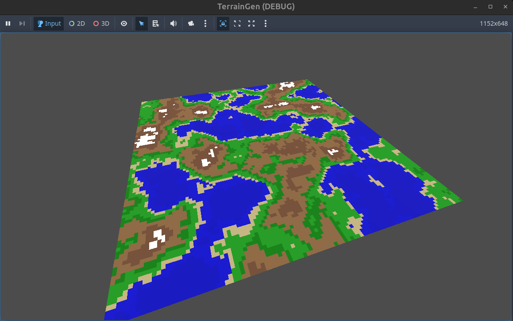
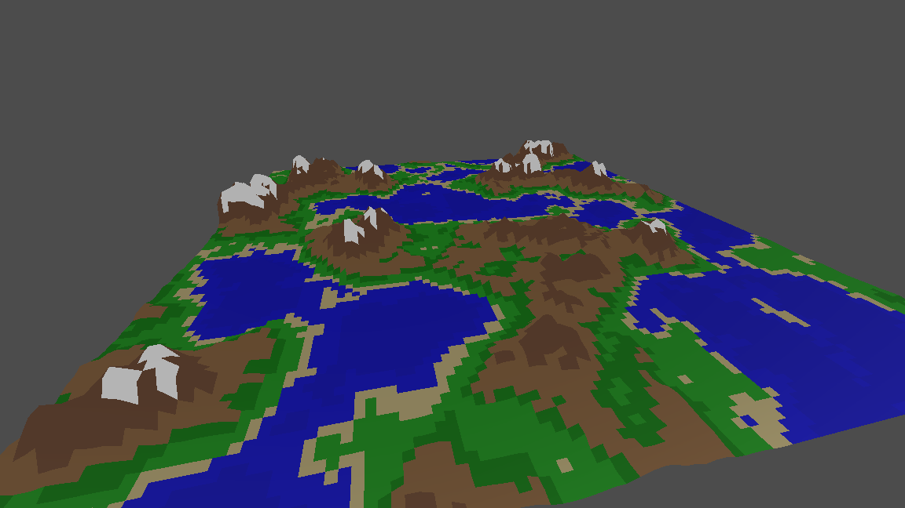
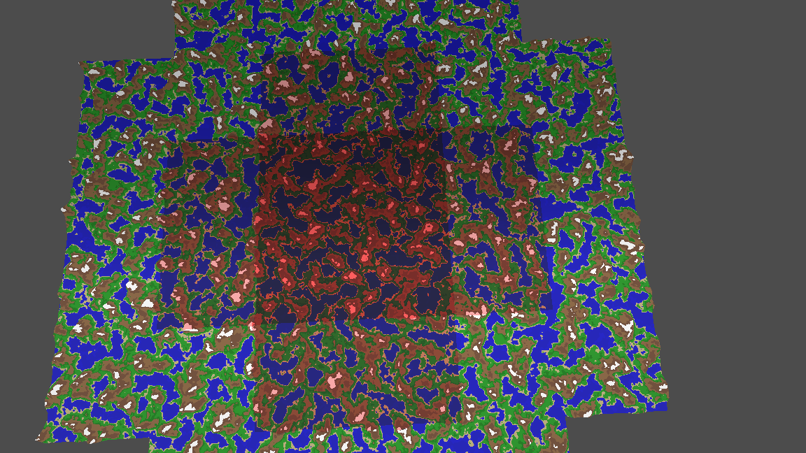
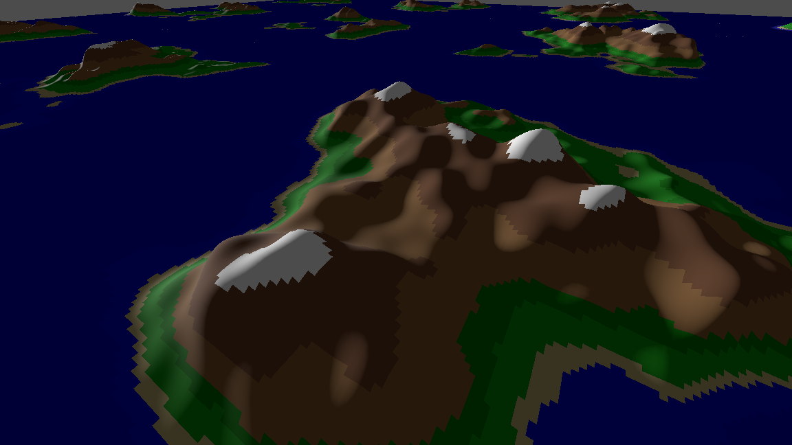
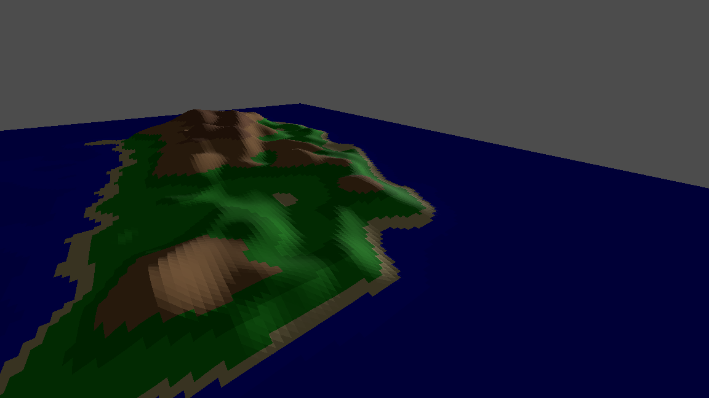
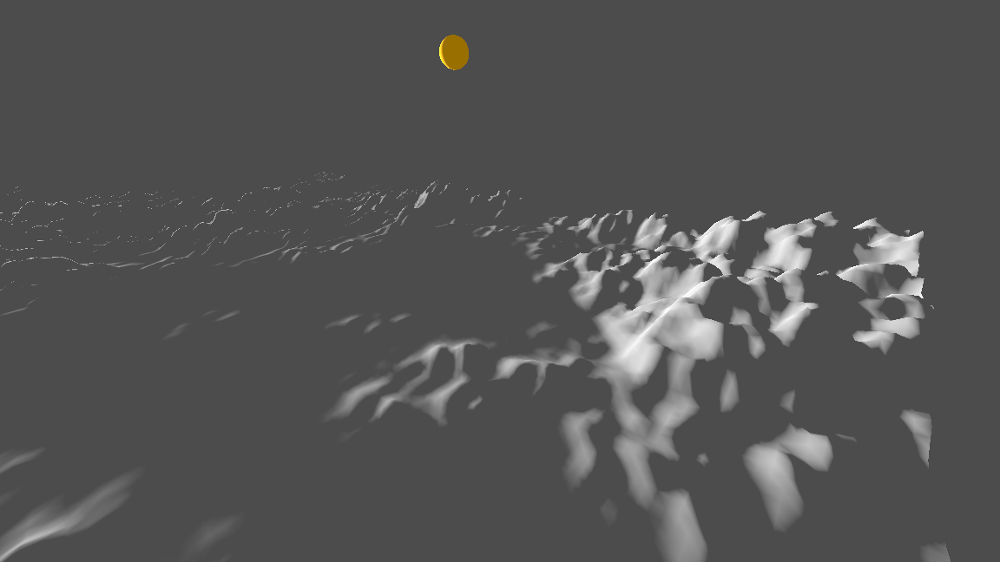
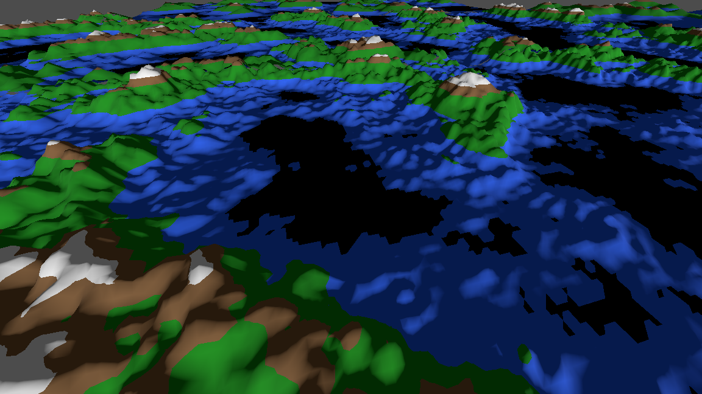

# Terrain Generation in Godot

This project implements procedural terrain generation following Sebastian 
Lague's youtube [playlist](https://www.youtube.com/watch?v=wbpMiKiSKm8&list=PLFt_AvWsXl0eBW2EiBtl_sxmDtSgZBxB3) 
but in Godot instead of Unity. 

The purpose of this project was to learn about perlin noise, terrain generation
and to get some more experience using Godot. Each of Sebastian's episodes 
is a different commit in the history (`git log`)

## Screenshots

### Perlin Noise

### Mesh Generation

### Procedular Generation
<video controls src=".docs/demo_03_Proc Gen 02.webm" title="alt text"></video>

### Colors

### LOD

### Endless Terrain
<video controls src=".docs/demo_08.webm" title="Title"></video>

### LOD switching
<video controls src=".docs/demo_07.webm" title="Title"></video>

### Falloff

### Normals

### Collisions
<video controls src=".docs/demo_13_collissions.webm" title="Title"></video>

### Flat Shading
Normal Shading | Flat Shaded
---------------|-------------
 |  

### Data Storage

### Color Shader

### Texture Shader

## Caveats
Due to the differences between Unity and Godot there will be many difference in 
how things get implemented but it tries to follow the same general architectural
patterns. One of the big differences is the difference in support for "In-Editor"
controls in Godot compared to Unity. You'll see alot of `[Export]` properties 
with their corresponding `get;set;` in order to emulate the behavior in Unity.